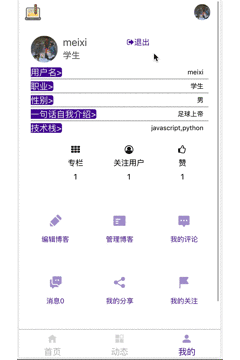

 

 # 格子博客

## 🐶 功能
这是一个类似 掘金 的博客系统。在页面上也参考了 掘金 的样式。并有用户注册/登录/关注、博客编辑/修改/管理/评论/回复、专栏创建/参与/关注文章发布 等功能。

****
#### 下面是一些应用的GIF图(以PC端为例)：
##### 整体预览：
<div align=center>

 

 </div>

##### 1. 用户注册登录
<div align=center>



</div>

##### 2. 编辑/发布/修改/删除 博客
<div align=center>


</div>

##### 3. 专栏创建/专栏文章发布/关注、参与专栏
<div align=center>


</div>

##### 4. 博客/专栏文章的点赞、分享、评论和消息回复
<div align=center>


</div>

 

#####  其他 ... ...
*****
 


## 🐌 运行
>进入server目录，`npm run startServer` 开启服务器, 监听3001

>`npm start` 启动前端React 应用

## 🌱 开发

>在[腾讯文档 “格子博客”博客平台前后端全栈项目设计](https://docs.qq.com/doc/DYlNPa0VsVmZwaXJX?tdsourcetag=s_macqq_aiomsg)有项目的初步设计和遇到问题及其解决的记录。

## 🦊 独创组件功能/常见功能独创方案及其技术原理

#### 1. 使用 Hooks 封装的用于上传图片的 通用组件：

```javascript

// Components/UploadPicture.js:

function  UploadPicture({url}){// url 是前端上传图片的请求路由

        /*

        设置用于图片上传的 相关tate 和 Ref：如文件 formData对象

        */

    function  pictureHandler( ){

        /*

        文件 input 变化时，将文件读入FileReader对象和FormData对象，

        前者用于加载本地图片，

        后者用于上传图片的载体,

        并将两者写入 state

        */

    }
    async  function  upload(){

        /*

        将state存储的图片 formaData 对象，上传到服务端

        */

    }
    return(

      <input  type  =  'file'/>

    )

}

export  default UploadPicture

```

使用：

```javascript

<UploadPicture  url  =  {'/uploadordeletepicture/modifyblogpicture'}/>

```

####  2. 使用自定义Hooks结合Redux的缓存功能，做一个历史路径（像  `首页 > 专栏 > 文章 `  这样的浏览历史的路径，我不知道其他人怎么叫，我看其他网站有这个东西就自己想到用自己的方案做出来了）

下面这个 UseHistoryPath 是一个往 Redux 添加、删除浏览历史的组件，还提供点击导航到对应页面的功能。

```javascript

function  UseHistoryPath({history}){

const [Redux_History,  setRedux_History]  =  useState([]);

useEffect(()  =>  {

....//在这里添加从Redux获取历史和每一次进入页面 / 退出页面添加 / 删除历史的逻辑

})

function  toPath(index){//点击导航到对应页面，并且在Redux删除后面的历史

    if(index +  1  === Redux_History.length  )  return;

    console.log(1  + index - Redux_History.length)

    history.go(  1  + index - Redux_History.length  )

    if(Redux_History.length  - index >  2){

        store.dispatch(delete_history( index ))

    }

}

return(

   <div>

  {

  Array(...Redux_History).map((ele,index)  => <span  key = {uuid()}

    onClick = {()  =>  toPath(index)}>

       {ele.name} >

    </span>

    )

    }

</div>

)

```

Redux里定义添加和删除历史的action和reducer即可，具体可以看看源码。

在其他页面引入这个组件即可在页面中显示浏览历史和便捷的导航服务。
#### 3. 使用 useReducer 管理一个页面内的当前状态：

下面的管理用户博客的表格使用了局部状态来管理博客的发布/删除状态

```javascript

function  reducer(state,action){

    switch(action.type){

        case  'remove':{

            state.push(action.blogID)

            state =  [...new  Set(state)]

            return state

        }

        case  'republish':{

            let newstate  =  state.filter(ele => ele!==action.blogID)

            state =  [...new  Set(state)]

            return newstate;

        }

        default:  return state

    }

}

export  function  ManageBlogTable(props){

    const [state,  dispatch]  =  useReducer(reducer,props.blogIDRemoved)

    function  remove(blogID){

        props.removeBlog(blogID)

        dispatch({type:'remove',blogID})

        console.log(state)

    }

    function  republish(blogID){

        props.republishBlog(blogID)

        dispatch({type:'republish',blogID})

        console.log(state)

    }

    return(

        <table>

            {

            /*

            博客的信息

            和操作博客 删除/再发布 的按钮

            可触发dispatch(action)

            */

        }

     </table>

  )

}

```


## 🐼 React  的常规使用
#### 1. 使用自定义 Hooks
下面是一个使用自定义 Hooks 请求用户关注的专栏的例子：

```javascript

// Components.UseFetchIWatchedColumns.js:

import api from '../../api'

import {useState,useEffect} from 'react';

function UseFetchIWatchedColumns(username){

    console.log(username)

    const [columns, setColumns] = useState([])

    useEffect( ()=>{

       fetch()

    },[username])

    async function fetch(){

        let res = await api.get('/column/watchedcolumns',{username})

        if(res.code === 0){

            setColumns(res.data)

            console.log('自定义 Hooks fetch 关注的专栏',res.data)

        }

    }

    return columns

}

export default UseFetchIWatchedColumns

```
#### 2.  HOC(高阶组件）
一个为复用获取用户专栏的逻辑的高阶组件：

```javascript

const FetchUserColumnHOC  =  (Warppedcomponent) =>(username)=> {

    return class extends Component{

        constructor(props){

            super(props)

            this.state={

               userColumn:[],

            }

        }

       async fetch(){

            let res  =  await  api.get('/column/usercolumn',{username})

            if(res.code===0){

                console.log(res)

                this.setState({userColumn:res.data})

            }

    }

        componentDidMount(){

           this.fetch()

        }

        render(){

           return  <Warppedcomponent  userColumn={this.state.userColumn}></Warppedcomponent>

        }

    }

}

export  default FetchUserColumnHOC

```

使用它：

```javascript

const ManageContainer  =  FetchUserColumnHOC(Manage)(localStorage['username'])

```

注意⚠️：高阶组件中传入的组件形参必须是首字母大写！！！！

## 🦖 React-router 的常规使用
#### 1. 用一个单独文件收集应用内所有路由，并结合Redux，使react-router的路由页面内可以访问到 Redux 的store。
```javascript

const history  =  createBrowserHistory()

class  AppRouter  extends  Component{

    componentDidMount(){

    }

    render(){

         return(

            <Router  history={history}>

                <Switch>//下面每一个页面都可以通过props.history访问到路由历史

                    <Route  exact  path='/'  component={APP}></Route>

                    <Route  path='/login'  component={Login}></Route>

                    <Route  path='/register'  component={Register}></Route>

                    <Route  path='/editblog'  component={Edit}></Route>

                    <Route  path='/blogdetails/:blogID'  component={BlogDetails}></Route>

                    <Route  path='/manage/:userID'  component={Manage}></Route>

                    <Route  path='/mycomment'  component={Mycomment}></Route>

                    <Route  path='/message'  component={Message}></Route>

                    <Route  path='/myshare'  component={ShareHistary}></Route>

                    <Route  path='/userpage/:userID'  component={UserPage}></Route>

                    <Route  path='/atypeblogs/:type'  component={BlogsAType}></Route>

                    <Route  path='/mywatch/:userID'  component={MyWatch}></Route>

                    <Route  path='/editcolumn'  component={ColumnEdit}></Route>

                    <Route  path='/mycolumnmanage'  component={ManageColumn}></Route>

                    <Route  path='/articleeditor/:columnID'  component={ArticleEditor}></Route>

                    <Route  path='/columndetails/:columnID'  component={ColumnDetails}></Route>

                    <Route  path='/articledetails'  component={ArticleDetails}></Route>

                    <Route  path='/modifyblog/:blogID'  component={ModifyBlog}></Route>

                    <Route  path='/publishmyactive'  component={PublishMyActive}></Route>

                    ......

               </Switch>

       </Router>

     )

}

}

const APPRouter  =  connect()(AppRouter)

export  default APPRouter;

```

使用React-router与Redux结合，由于React-router的 ` <Route> ` 页面中需要取得Redux中的store数据，所以React-rudex的 ` <provider> ` 组件必须位于 ` <Route> ` 组件之上。有两种方法可以做到：

* 1.用 `<Provider>`包裹`<Router>` 即用一个 `<Provider>` 一次性包裹所有路由页面，我在这里用的是这种：

```javascript

ReactDOM.render(

<Provider  store={store}>

    <APPRouter/>

</Provider>

,  document.getElementById('root'));

```

* 2.用 `<Router>` 的createElement属性，给每一个 `<Route>` 页面组件外面都包裹一个 `<Provider>`:

```javascript

const createElement  =  (component，props) => (

return  (

<Provider  store={store}>

    <Component  {...props} />

</Provider>

)

)

const Routes  =  () => (

<Router  history={history}  createElement={createElement}  />

)

```

第一个参数component代表 `<Route>` 对于页面组件,第二个参数props是传入组件的参数。

⚠️注意：我使用 `<Router>` 的原因：

Router 是所有路由组件共用的底层接口。通常，我们的应用程序将使用其中一个高级路由器代替：
`<BrowserRouter>` `<HashRouter>` `<MemoryRouter>` `<NativeRouter>` `<StaticRouter>`

最常见的使用底层 `<Router>` 的情形就是用来与 `Redux` 或者 `Mobx` 之类的状态管理库的定制的 `history` 保持同步。注意不是说使用状态管理库就必须使用 `React Router` ，它仅用作于深度集成。

----[React-router官网文档](https://react-router.docschina.org/web/api/Router)
## 🐎 Redux 的常规使用
#### 1. 一个状态管理的例子：

在项目文件里分为容器组件Containers、动作Actions、状态操作纯函数Redusers(Store)。下面以首页组件为例，最后导出的其实是一个容器组件，所以在子组件Home里可以调用this.props.dispatch(fetch_all_Blogs())，注意前面的async-await，如果没有这2个关键字，那么应用在首次加载或刷新时将不会得到异步请求得到的数据，因为dispatch（）里面是一个网络请求的异步操作，如果前面不加await，那么执行dispat（）后就不会等待异步操作结果，而是继续执行下面的res;加了await后，后面的res会等待前面dispatch发出的API请求返回结果进而获取的数据：

```javascript

//Home.js:

import  {fetch_all_Blogs}  from  '../../Redux/Actions/fetchBlogs'

import  {connect}  from  'react-redux';

class  Home  extends  Component{

    async fetch()  {

        await  this.props.dispatch(fetch_all_Blogs())

        let res  =  this.props.fetchBlogsRes;

        console.log(res)

        this.setState({blogs:res.res,fetch_status:res.status})

        console.log(this.state)

    }

    ...  ...

}

const HomeContainer  =  connect()(Home)

export  default HomeContainer;

```

#### 2. 专栏文章缓存和删除
进入一个专栏文章之前先将文章存入 Redux，推出后删除。


#### 3. Redux可以用在哪里：

*  1. 管理应用的网络请求数据（配合使用Redux中间件 Redux-thunk）;

*  2. 管理应用的UI状态，保留应用上一次的状态。比如缓存 Tab ,在有3个tab的页面里在第二个tab里进入一个子页面后回来，不会显示第一个默认的tab,而是上次进入的tab;

*  3. 缓存一些应用全局需要的数据，把应用全局需要的信息保存在Redux，在其他任何地方只要需要就可以从Redux获取。比如我做了一个首页的稍后看文章列表，把像稍后再看的文章加入到这个列表里面，只要不关闭或者刷新应用，那么这些文章将一直存在Redux Store里，可以随时再看。

*  4. 缓存 浏览器 history,可以用于导航

*  5. 在一个页面把一些将要浏览的数据存下来，进入另一个页面客快速获取到这些数据。如我在进入专栏文章详情之前，把相应的文章内容保存到Redux，进入文章详情页面时直接从Redux获取文章数据，当然推出是也应该从Redux删除缓存的文章内容。

>> 只能说用过Redux的才知道 Redux 多么有用 ！！

## 🦀 其他常见功能技术原理
#### 1. 图片后端存储与前端显示
##### (一)、后端图片存储方式

* 将图片以文件形式存在服务器指定的文件夹里，再将图片的路径存在数据库字段；

* 图片转换为二进制流，直接存储在数据库的Image类型字段里。

对于这两种方式，前端获取显示图片的方式分别是：

* 对于第一种，前端把从数据库获得的图片路径给src属性即可；（这种最常用）

* 对于第二种，前端需要将其二进制流交由blob对象来处理，然后通过blob的API生成临时URL赋给src属性来显示图片。

----[你知道前端对图片的处理方式吗](https://juejin.im/post/5c6276956fb9a04a06055925)

##### (二)、multer 库

我再后端用multer库来接收前端上传的图片，由于bodyPaser这个库只能解析请求体中的Content-Type为

* application/json

* application/x-www-form-urlencoded

* application/octet-stream

* text/plain

四种数据，别的类型（比如上传图片用的multipart/form-data），就无能为力。所以选择multer这个中间价来解析Content-Type为multipart/form-data的数据。

后端：

```javascript

// router/user.js:

var multer  =  require('multer')

var storage  =  multer.diskStorage({

    destination:  'server/public/img/usersAvatar',

    filename: function(req,  file,  callback)  {

          callback(null,  Date.now()  +  file.originalname);

    }

});

var imageFilter  = function (req,  file,  cb)  {

    // accept image files only

    if  (!file.originalname.match(/\.(jpg|jpeg|png|gif)$/i))  {

         return  cb(new Error('Only image files are allowed!'),  false);

    }

    cb(null,  true);

};

var upload  =  multer({  storage:  storage,  fileFilter:  imageFilter})

router.post('/avatar',upload.any(),function(req,res,next){

let avatar  =  req.files[0]

let {username}  =  req.body

console.log('avatar',avatar,req.body)

users.findOne({username},(err,data)=>{

        data.imgAvatar_url  = avatar.path//'http://localhost:3001/'+

        data.save((err,data)=>{

            if(err){

                console.log('头像入库出错')

                res.json({code:1,data:'头像入库出错'})

            }else{

                console.log('头像入库成功',data)

                res.json({code:0,data:'头像已经入库'})

            }

        })

})

})

```

###### (三)、前端图片获取

前端获得数据库中图片的路径后用img的src属性请求，以获取用户头像为例：

```javascript

// Houme.js:

</img>

```

⚠ 在编辑博客页面中也有上传博客内容里的图片的部分，原理是，用户编辑markdown的文章到某一部分，可以选择插入图片，先点击上传图片，然后前端会获得图片信息，自动上传到后端存储起来，后端再把所存储的图片再后端的路径传回给前端，前端获得图片的路径后将以markdown语法在博客内容中插入图片路径，同时在预览部分显示出来。

#### 2. 上拉加载、节流、分页


>**上拉加载** :比如首页博客每次只获取5条，滑倒底部才能发出获取第二页的请求。思路是：前端维护一个页码page变量，每次滑倒底部page加一，并且带着这个page发出请求，获取对于页码的博客。

>**节流**：监听上拉 scroll 事件时，减少事件监听器触发的频率。
1. 前端:

```javascript

// /Home.js:s

async fetch(page)  {

    await  this.props.dispatch(fetch_all_Blogs(page))

    let res  =  this.props.fetchBlogsRes;

    console.log(res)

    if(res.code===0){

        let blogs  =  [...this.state.blogs,...res.res]

        this.setState({blogs:blogs,fetch_status:res.status})

    }else  if(res.code===1){

        this.setState({hasMoreBlogs:false})

    }

}

scrollHandler=(e)=>{

    if(this.isScrollListenerRunning){

        return

    }

    console.log(
        document.body.offsetHeight,

        window.pageYOffset,

        document.body.clientHeight,

        this.loadmore.current.offsetTop,

        window.screen.availHeight

    )

    if(  window.pageYOffset+window.screen.availHeight  >  this.loadmore.current.offsetTop  &&  this.state.hasMoreBlogs){

        this.isScrollListenerRunning  =  true

        console.log('该刷新了')

        this.setState({isPending:true})

        this.setState((preState,props)=>({page:++preState.page}))

        this.timer  =  setTimeout(()=>{this.fetch(this.state.page);

        //this.setState({hasMoreBlogs:true});

        this.isScrollListenerRunning  =  false},2000)

}

}

    componentDidMount(){

        this.fetch(1)

        this.isScrollListenerRunning  =  false

        window.addEventListener('scroll',  this.scrollHandler)

   }

    componentWillUnmount(){
 
        window.removeEventListener('scroll',this.scrollHandler)

        clearTimeout(this.timer)

    }

```

⚠️ 注意：

*  `window.addEventListener`和` window.removeEventListener`这两个里面回调函数参数应该是同一个（该函数不能传入参数，即使是参数值相同，也会被认为是两个不同的函数），否则在componentWillUnmount将不能删除原来的监听事件的函数，那么就会造成组件卸载时监听事件为删除出现错误，比如像下面这样就会出错：

window.addEventListener('scroll', this.scrollHandler(e))

window.removeEventListener('scroll',this.scrollHandler(e))

* 另外，scrollHandler()要写出箭头函数的形式，保证this.loadmore.current.offsetTop里面的this是外面的Windows对象，否则会出现访问current出错。

* 由于上滑是不断触发scrollHandler（）对页码不断加1，然后请求对应页码的数据，如果页码增加太快，那么就可能造成请求到后端数据库没有对应页码的数据没有东西了。因此为了减少scroll事件触发的频率，我用了节流方法，确保用户上拉触发时只响应第一次触发，在一段时间内监听到scroll但不会响应。

2. 后端：

```javascript

// router/blog.js

let page  =  req.query.page  ||  1

let pageSize  =  5

let offset  =  pageSize*(page-1)

let blog_s  =  []

blog_s =  await blogs.find({}).skip(offset).limit(pageSize)

// 返回blog_s就是按页码查询到的博客

```

#### 3. 用 JWT 实现用户认证，以便于保护用户的信息等
JWT 用于校验用户身份，可以防止用户的信息如博客等被篡改。

使用 JWT 的方式是在用户登录成功后将用户的ID存在 token 里，这个 token 被送回给用户，然后以后用户每一次操作都会在请求中带上这个 token，服务端验证 token 合法（比如 token 没有过时，确定 token 是用户自己签发的），合法的话就允许用户的操作，不合法就返回 401 Not Allow

签发的 token 是在服务器端生成，存储在客户端，客户端可以将其存在locaStorage，然后可以通过 cookie 发送这个 taken 给服务区用于校验，或者放在请求头 authorization ,或者直接放在请求体中。

登录后后端返回 token，前端在 locaStorage 中储存 token 需要的时候再取用。在登录后每一个对于用户的安全信息敏感的请求操作都要带上 token，后端验证这个 token 合法之后才调用 next（）继续下一步。 前端需要拦截 axios 请求，在请求头中加上 uthorization = token，后端对应的路由需要加上验证 token 的中间件。

*1. 前端 axios 拦截配置：*

```js
// 请求拦截，用于将请求统一带上 token

axios.interceptors.request.use(config => {
    // 在 localStorage 获取 token
    let token = localStorage.getItem("token");
    console.log('axios配置:token',token)
    // 如果存在则设置请求头
    if (token) {
      
        config.headers['Authorization'] = token;
        console.log(config)
    }
    return config;
});
```
*2. 后端验证 token 的中间件：*
```js
var jwt = require('jsonwebtoken');
var secret = require('../config').jwt_secret;

let auth = (req, res, next) => {
    // 获取请求头 authorization
    let authorization = req.headers["authorization"];
    console.log(req.headers,authorization)
   
    // 如果存在，则获取 token
 
    if (authorization) {
        let token = authorization;
        try {
            // 对 token 进行校验

            jwt.verify(token,secret,(err,decoded)=>{
                if(err){
                    next(err)
                }else{
                    console.log(decoded)
                    next()
                }
            })
        } catch (e) {
            res.status(401).send("Not Allowed");
        }
    
    } else {
        res.status(401).send("Not Allowed");
    }
    
 
}
module.exports = auth

 

```

*3. 在登录后的每一个用户操作请求路由中加上验证中间件：*
```js
router.post('/remove',auth,(req,res,next) => {...})

router.post('/modify',auth,(req,res,next) => {...})

。。。。等等
```
## 🐆 项目技术栈

### （1）前端（`React 16.8.4` + `Redux` + `React-router` )
React、Redux、React-router的作用自不必说。
******
#### 一些对本项目重要的库
* remarkable
  **解析markdown博客**

* textarea-markdown  
  **输入markdown实时预览** 

* history
  **管理JavaScript会话历史**


* Redux-thunk
  **Redux 的异步Action 生成器**


* axios 
  **网络请求（这个需要配置负载 token 的请求头，与上面的jsonwebtoken 有关系**
  

******
一些前端用的较多的UI组件

* React Toastify toast

* react-progress-button

* react-select

* react-if
******
### （2）后端（ Express + MongoDB + Mongoose ）

重要的库
* [Multer](https://www.npmjs.com/package/multer)
     **后端接收和存储**
* [mongoose](https://www.npmjs.com/package/mongoose)
     **MongoDB的Node驱动**
* [jsonwebtoken](https://www.npmjs.com/package/jsonwebtoken) 
  **jwt生成器**
* [async](https://www.npmjs.com/package/async)
   **Node 异步控制流库**
   
## 🦑 项目目的和意义
通过实践巩固React知识，在全面学习完React官方文档并接触到React的新特性（Hooks、CreateRef……）之后用上这些新特性，在React的学习上更进一步，同时重新拾起Redux、React-router,使自己对它们的运用达到熟练的地步。为了快速练习React的各种特性，在学习webpack刚刚起步还没有上手的阶段，我使用了create-react-app来快速的初始化项目结构。最后，还有一个，就是为React Native的项目做一个铺垫，在React Native的项目中，我会用React Native重构这个博客应用。
## 🐁 项目中遇到的一些及解决问题
* （1）从服务获取到的数组有时候不是数组类型，前端不能用数组方法，想读取它的长度还要用call调用数组方法flat（）把它平面化

```javascript

console.log(typeof column.participator  )// Object

column.participator.length//这样不行

Array.prototype.flat.call([column.participator]).length//对

```

* (2)localStorage存储数组用的是字符串形式：

在浏览器web storage里面取到的数组其实是字符串形式的（以 ‘ ，’隔开），所以要用split(',')方法转换为数组

* ???? (3) 使用React Hooks之一 useEffect()有点问题(也有可能是useState()),在我更新 replys 后页面没有重新渲染：

```javascript

// ArticleDetails.js

if(res.code  ===  0){

    let newReplys  =  replys;

    newReplys.push(res.data)

    console.log(newReplys)

    setReplys(newReplys)// 这里并没有引起 Replys 改变重新渲染，不知道为什么，

    toast.success('回复发送成功',{autoClose:1200})

}

```
* (4) 结合Hooks和Redux遇到的一个坑：

```javascript

const [article,  setArticle]  =  useState(store.getState().articleCached)

useEffect(()  =>  {

    let artcile  =  store.getState().articleCached

    console.log(article)

    setArticle(artcile)

},[])

```

上面这个 hooks 里，如果我在定义 useState 时不传入 store.getState().articleCached ，而是用 useEffect 里用 setArticle( store.getState().articleCached ),那么state将得不到 store.getState().articleCached。这个问题的原因有待解决。
* （5）隐藏<input type = 'file' id='fileInput'/>的样式可以用 `display：‘none’`,然后用`<label for='fileInput'/>` 来触发 `<input>`,只要美化 `<label/>`即可

## 🐓 计划加入功能
* 1）加入 XSS 防御，用 [XSS](https://www.npmjs.com/package/xss)这个npm包


